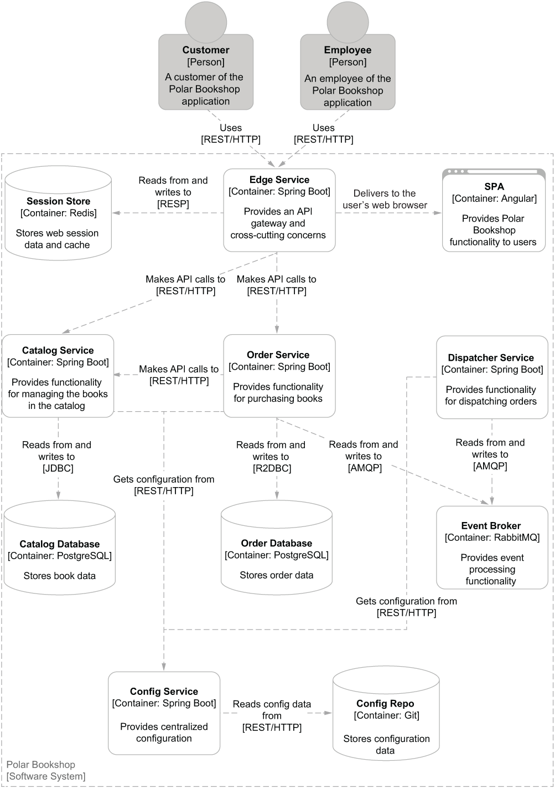

## Requirements

- java 21
- podman

## Basic commands

```bash
./gradlew help
```

```bash
./gradlew tasks
```

```bash
./gradlew bootRun
```

```bash
./gradlew bootBuildImage
```

```bash
docker images catalog-service:0.0.1-SNAPSHOT
```

```bash
docker run --rm --name catalog-service -p 8080:8080 \
    catalog-service:0.0.1-SNAPSHOT
```
[see localhost:8080](http://localhost:8080/)

## Local Kubernetes Deployment

```bash
curl -LO https://storage.googleapis.com/minikube/releases/latest/minikube-latest.x86_64.rpm
```
```bash
sudo rpm -Uvh minikube-latest.x86_64.rpm
```
```bash
minikube config set driver podman
```
```bash
minikube config set rootless true
```
```bash
minikube start
```
```bash
minikube image load catalog-service:0.0.1-SNAPSHOT
```
```bash
kubectl create deployment catalog-service \
    --image=catalog-service:0.0.1-SNAPSHOT
```
```bash
kubectl logs deployment/catalog-service
```
```bash
kubectl expose deployment catalog-service \
    --name=catalog-service \
    --port=8080
```
```bash
kubectl port-forward service/catalog-service 8000:8080
```
[see localhost:8000](http://localhost:8000/)

```bash
## kubectl get service
kubectl delete service catalog-service

## kubectl get deployment
kubectl delete deployment catalog-service
```

## Architecture of Polar Bookshop



```bash
./gradlew bootJar
```
```bash
java -jar build/libs/catalog-service-0.0.1-SNAPSHOT.jar
```
```bash
# NOTE Another practical Gradle task is build, 
# which combines the operations of the 
# bootJar and test tasks.
./gradlew build
```
```bash
./gradlew bootRun
```
[see localhost:9001](http://localhost:9001/)

```bash
http :9001/
```
```bash
java -jar build/libs/catalog-service-0.0.1-SNAPSHOT.jar \
    --spring.profiles.active=prod
```
```bash

```
